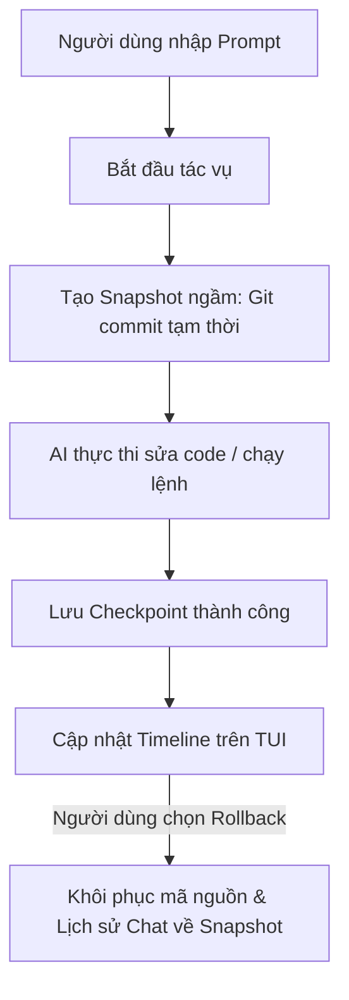
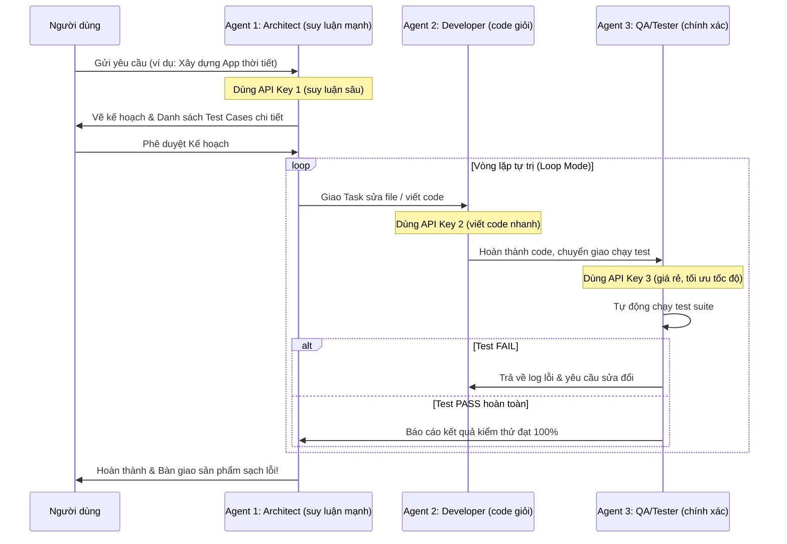

# ĐỀ XUẤT THIẾT KẾ KIẾN TRÚC: CÁC TÍNH NĂNG ĐỘC QUYỀN CHO ORCACODE

Tài liệu này phác thảo chi tiết thiết kế kỹ thuật, luồng dữ liệu và giao diện (UI/UX) cho 3 tính năng đột phá nhằm đưa OrcaCode TUI vượt lên trên các IDE thông thường, trở thành một **Autonomous Workspace (Không gian làm việc tự trị)** thực thụ.

---

## Ý TƯỞNG 1: Checkpoint Time-Travel (Du hành thời gian Workspace)

### 1.1. Bản chất & Mục tiêu
Cho phép người dùng theo dõi lịch sử thay đổi của **toàn bộ Workspace** dưới dạng các Checkpoint trực quan. Người dùng có thể quay ngược thời gian (Rollback) toàn bộ trạng thái code, cơ sở dữ liệu và lịch sử chat về một thời điểm bất kỳ nếu AI đi sai hướng hoặc làm hỏng cấu trúc dự án.

### 1.2. Thiết kế Kỹ thuật (Architecture)
Hệ thống sử dụng một kho lưu trữ Git cục bộ ngầm (hoặc thư mục cache cô lập `.orca/checkpoints/` nếu không muốn ảnh hưởng đến Git chính của dự án) để lưu snapshot.



* **Dữ liệu lưu trữ trong 1 Checkpoint:**
  1. Bản sao lưu trạng thái file (Git SHA hoặc file bản sao lưu nén).
  2. Lịch sử hội thoại tại thời điểm đó (`history.json`).
  3. Mô tả ngắn gọn về hành động vừa thực hiện (ví dụ: *"Sửa hàm ApiService.js"*).

### 1.3. UX/UI trên TUI
* Một tab phụ mang tên **TIMELINE** ở thanh Sidebar bên phải hiển thị danh sách checkpoint:
  ```text
  TIMELINE ───────────────────────────
  ● [17:10] Khởi tạo dự án (Gốc)
  ● [17:15] Tạo Model DataModel.js (AI)
  ● [17:19] Sửa lỗi ApiService.js (AI) ◀ (Đang chọn)
  ○ [17:22] Chạy server thử nghiệm (AI)
  ────────────────────────────────────
  [ Rollback về đây ]  [ Xem mã nguồn ]
  ```

---

## Ý TƯỞNG 2: Live Architecture Graph (Sơ đồ kiến trúc động)

### 2.1. Bản chất & Mục tiêu
Trực quan hóa cấu trúc liên kết và import giữa các file trong dự án dưới dạng sơ đồ đồ thị ASCII động. Khi AI đang đọc hoặc sửa file nào, nút (node) tương ứng trên sơ đồ sẽ phát sáng.

### 2.2. Thiết kế Kỹ thuật
* **Phân tích tĩnh (Static Analysis):** Trình quét nền (background scanner) phân tích các câu lệnh `import`, `require`, hoặc `from ... import ...` để dựng đồ thị liên kết dạng Directed Acyclic Graph (DAG).
* **Render ASCII/Unicode:** Sử dụng thư viện Rich để vẽ cây thư mục và đồ thị quan hệ bằng các ký tự nét vẽ Unicode (`┌`, `├`, `─`, `▲`).

```text
 kiến trúc dự án ──────────────────────────────────────
   [app.js] ◀ (AI đang sửa)
      │
      ├───► [viewmodels/DashboardViewModel.js]
      │         │
      │         └───► [services/ApiService.js] ◀ (AI đang đọc)
      │                   │
      │                   └───► [models/DataModel.js]
 ───────────────────────────────────────────────────────
```

### 2.3. Hiệu ứng động (Animation)
* Khi Agent thực hiện lệnh đọc/ghi file, TUI sẽ tự động kích hoạt hiệu ứng chớp nháy hoặc đổi màu sắc node tương ứng trên đồ thị.

---

## Ý TƯỞNG 3: Agent Swarm Teamwork (Biệt đội AI đa API)

### 3.1. Bản chất & Mục tiêu
Thay vì dùng 1 Agent duy nhất, chế độ này chia tách công việc cho **3 Agent chuyên biệt** chạy phối hợp xoay vòng. Đặc biệt, người dùng có thể cấu hình **3 API Keys khác nhau** (hoặc 3 mô hình khác nhau) để tối ưu hóa thế mạnh của từng model và tiết kiệm chi phí.



### 3.2. Vai trò & Phân bổ Mô hình (Model Assignment)

| Vai trò Agent | Nhiệm vụ chính | Đề xuất Mô hình tối ưu | Loại API Key |
| :--- | :--- | :--- | :--- |
| **Agent 1: Architect** | Đọc hiểu cấu trúc toàn cục, lập kế hoạch chi tiết, thiết kế kiến trúc và phân tích nghiệp vụ. | `deepseek-reasoner` / `claude-3-5-sonnet` | API_KEY_1 (DeepSeek/Anthropic) |
| **Agent 2: Developer** | Viết mã nguồn, chỉnh sửa/vá lỗi code (Patch) dựa theo kế hoạch và hướng dẫn của Architect. | `deepseek-chat` / `gpt-4o` | API_KEY_2 (DeepSeek/OpenAI) |
| **Agent 3: QA / Tester** | Viết bộ kiểm thử (test suite), chạy lệnh test, phát hiện bugs và kiểm chứng kết quả chạy. | `gpt-4o-mini` / `gemini-2.0-flash` | API_KEY_3 (OpenAI/Google) |

### 3.3. Cấu hình đa API Key trong tệp `.env`
Hệ thống sẽ nạp các API keys riêng biệt từ file môi trường:
```ini
# API Key chính (Fallback)
ORCA_API_KEY=sk-...

# API Keys riêng biệt cho Swarm Teamwork Mode
ORCA_SWARM_ARCHITECT_API_KEY=sk-anthropic-...
ORCA_SWARM_ARCHITECT_MODEL=claude-3-5-sonnet

ORCA_SWARM_DEVELOPER_API_KEY=sk-deepseek-...
ORCA_SWARM_DEVELOPER_MODEL=deepseek-chat

ORCA_SWARM_QA_API_KEY=sk-openai-...
ORCA_SWARM_QA_MODEL=gpt-4o-mini
```

### 3.4. Vòng xoay phối hợp tuần tự (Sequential Swarm Loop)
1. **Architect** nhận yêu cầu ➔ Phân tích mã nguồn hiện tại ➔ Lập Kế hoạch & Xác định danh sách Test cases cụ thể ➔ Đợi người dùng Duyệt kế hoạch.
2. Khi đã được duyệt, **Architect** khóa kế hoạch và gửi chỉ thị cho **Developer** thiết kế code.
3. **Developer** thực hiện các lệnh tạo file, vá code (`WRITE_FILE` / `PATCH_FILE`) ➔ Bàn giao cho **QA**.
4. **QA** viết các bài test tương ứng (ví dụ: file `test_weather.py`) ➔ Thực thi lệnh chạy test (`RUN_COMMAND`) ➔ Kiểm tra kết quả.
   - *Nếu kiểm thử thất bại:* **QA** thu thập log lỗi biên dịch/lỗi test ➔ Gửi báo cáo lỗi chi tiết cho **Developer** để sửa lại.
   - *Nếu kiểm thử thành công:* **QA** báo cáo lên **Architect** ➔ **Architect** đánh giá tổng thể, nếu đã hoàn thành mọi mục trong kế hoạch thì kết thúc và báo cáo cho người dùng.
5. Vòng lặp xoay tròn giữa **Developer** và **QA** chạy tự trị hoàn toàn cho đến khi **100% test cases đều PASS** hoặc người dùng chủ động nhấn dừng tiến trình.
